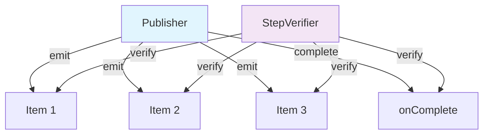
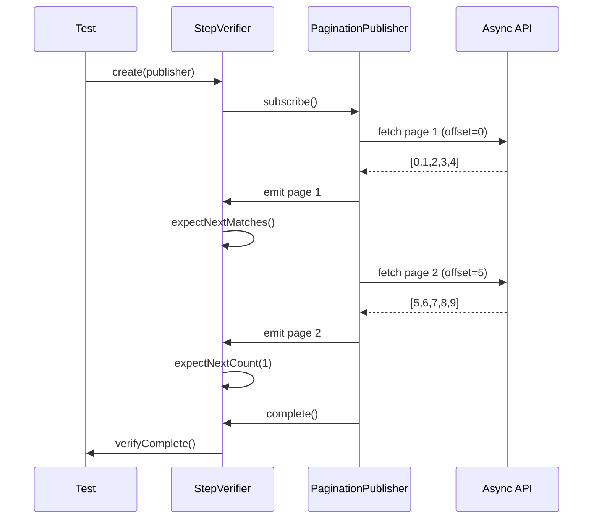
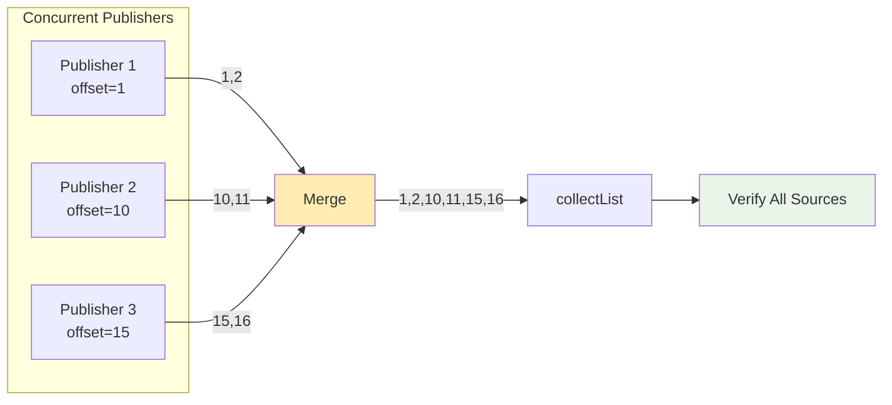
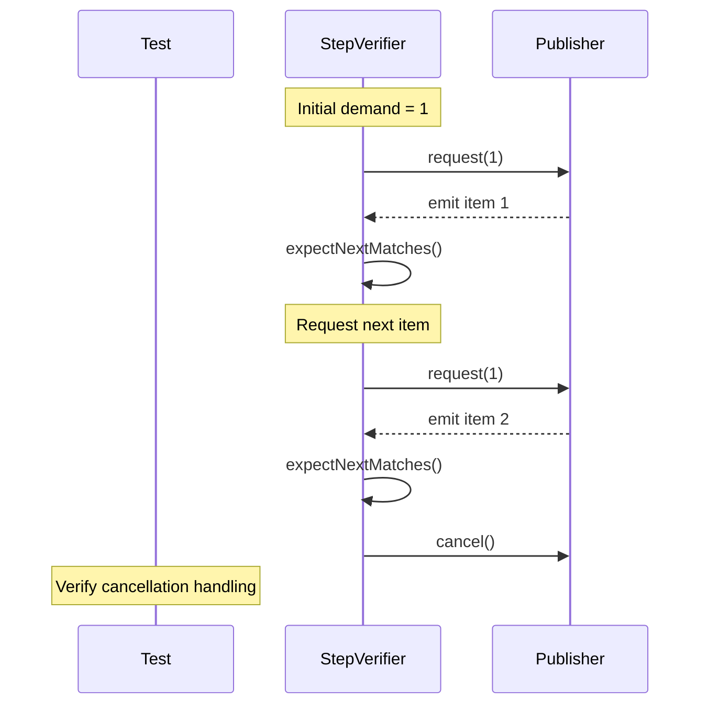
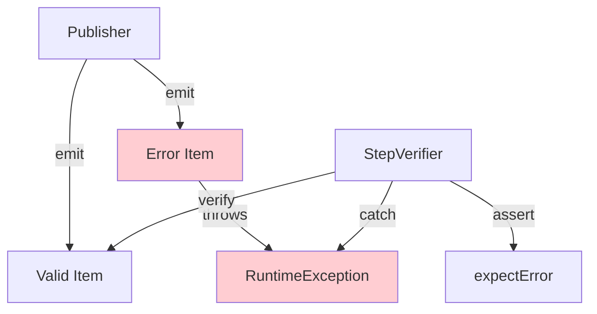
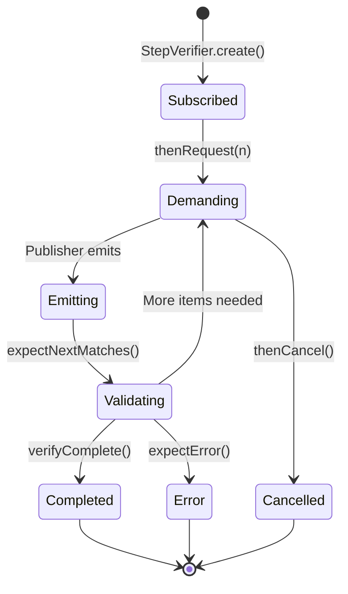

# 🔄 Java Reactive Testing Guide: StepVerifier and Async Stream Testing

This guide explains how reactive testing works in our async API tests, specifically focusing on Project Reactor's `StepVerifier` and the patterns we use to test asynchronous data streams.

## 📋 What is Reactive Testing?

Reactive testing validates asynchronous data streams and their behavior over time. Unlike traditional testing that checks single values, reactive testing verifies:

- **Stream completion** and **error handling**
- **Backpressure** and **demand management**
- **Concurrent execution** and **timing**
- **Sequential data emission** patterns



## 🔍 StepVerifier: The Testing Engine

`StepVerifier` is Reactor's testing utility that allows us to:

1. **Subscribe** to reactive streams
2. **Assert expectations** on emitted items
3. **Control demand** and simulate backpressure
4. **Verify completion** or error scenarios

### Basic StepVerifier Pattern:

```java
StepVerifier.create(publisher)
    .expectNext("item1", "item2", "item3")
    .verifyComplete();
```

### Core StepVerifier Methods:

| Method | Purpose | Example |
|--------|---------|---------|
| `expectNext(T)` | Expect specific next item | `.expectNext("hello")` |
| `expectNextMatches(Predicate)` | Expect next item matching condition | `.expectNextMatches(s -> s.startsWith("test"))` |
| `expectNextCount(long)` | Expect N more items | `.expectNextCount(5)` |
| `expectComplete()` | Expect stream completion | `.expectComplete()` |
| `expectError(Class)` | Expect specific error type | `.expectError(RuntimeException.class)` |
| `thenRequest(long)` | Request more items (backpressure) | `.thenRequest(10)` |
| `thenCancel()` | Cancel subscription | `.thenCancel()` |
| `verify()` | Execute verification | `.verify()` |
| `verifyComplete()` | Verify and expect completion | `.verifyComplete()` |

## 🎯 Testing Patterns Implemented

### 1. **Pagination Stream Testing**

Pagination testing validates that our async APIs correctly emit paginated data in sequence.



**Implementation Example:**

```java
@Test
void testAsyncPaginationOffsetLimit() throws Exception {
    SDK s = SDK.builder().build();
    
    // Create pagination publisher with offset=0, limit=4
    Flow.Publisher<PaginationLimitOffsetOffsetParamsResponse> publisher = 
        s.async().pagination()
         .paginationLimitOffsetOffsetParams()
         .offset(0L)
         .limit(4L)
         .callAsPublisher();

    Flux<PaginationLimitOffsetOffsetParamsResponse> flux = 
        JdkFlowAdapter.flowPublisherToFlux(publisher);

    StepVerifier.create(flux.take(3))
        .expectNextMatches(response -> {
            assertThat(response.statusCode()).isEqualTo(200);
            assertThat(response.res()).isPresent()
                .hasValueSatisfying(pageRes -> {
                    assertThat(pageRes.resultArray())
                        .isNotEmpty()
                        .hasSizeLessThanOrEqualTo(4);
                    // First page with offset=0 should start from 0
                    if (!pageRes.resultArray().isEmpty()) {
                        assertThat(pageRes.resultArray().get(0)).isEqualTo(0L);
                    }
                });
            return true;
        })
        .expectNextCount(2) // Expect 2 more pages
        .verifyComplete();
}
```

### 2. **Concurrent Stream Merging**

Tests multiple concurrent publishers and verifies all sources contribute to the merged stream.



**Implementation Example:**

```java
@Test
void testAsyncPaginationConcurrencyWithLimits() throws Exception {
    SDK s = SDK.builder().build();

    // Create concurrent publishers with different offsets
    List<Flow.Publisher<Long>> publishers = List.of(
        s.async().pagination().paginationLimitOffsetOffsetParams()
         .offset(1L).limit(10L).callAsPublisherUnwrapped(),
        s.async().pagination().paginationLimitOffsetOffsetParams()
         .offset(10L).limit(10L).callAsPublisherUnwrapped(),
        s.async().pagination().paginationLimitOffsetOffsetParams()
         .offset(15L).limit(10L).callAsPublisherUnwrapped()
    );

    Flux<Long> mergedFlux = Flux.merge(publishers.stream()
        .map(publisher -> JdkFlowAdapter.flowPublisherToFlux(publisher).take(2))
        .collect(Collectors.toList()));

    StepVerifier.create(mergedFlux.collectList())
        .expectNextMatches(results -> {
            assertThat(results)
                .hasSize(6) // 2 from each of 3 publishers
                .allSatisfy(v -> assertThat(v).isGreaterThanOrEqualTo(0L));
            
            // Verify all offset ranges contributed
            assertThat(results).anyMatch(v -> v >= 1L && v < 10L);   // offset=1
            assertThat(results).anyMatch(v -> v >= 10L && v < 15L);  // offset=10
            assertThat(results).anyMatch(v -> v >= 15L);             // offset=15
            
            return true;
        })
        .verifyComplete();
}
```

### 3. **Backpressure Testing**

Backpressure testing validates how publishers handle demand control and subscription management.



**Implementation Example:**

```java
@Test
void testAsyncPaginationBackpressure() throws Exception {
    SDK s = SDK.builder().build();

    Flow.Publisher<PaginationCursorParamsResponse> publisher =
        s.async().pagination()
         .paginationCursorParams()
         .cursor(1)
         .callAsPublisher();

    Flux<PaginationCursorParamsResponse> flux =
        JdkFlowAdapter.flowPublisherToFlux(publisher);

    StepVerifier.create(flux, 1) // Request only 1 item at a time
        .expectNextMatches(response -> {
            assertThat(response.statusCode()).isEqualTo(200);
            assertThat(response.res()).isPresent();
            return true;
        })
        .thenRequest(1) // Request next item
        .expectNextMatches(response -> {
            assertThat(response.statusCode()).isEqualTo(200);
            assertThat(response.res()).isPresent();
            return true;
        })
        .thenCancel() // Test cancellation handling
        .verify();
}
```

### 4. **Error Handling Verification**

Tests how streams handle and propagate errors correctly.



**Implementation Example:**

```java
@Test
void testMapAsyncErrorHandling() {
    Flux<Integer> source = Flux.just(1, 2, 3);
    Flow.Publisher<Integer> sourcePublisher = 
        JdkFlowAdapter.publisherToFlowPublisher(source);
    
    Function<Integer, CompletableFuture<String>> mapper = i -> {
        if (i == 2) {
            CompletableFuture<String> future = new CompletableFuture<>();
            future.completeExceptionally(new RuntimeException("Test error"));
            return future;
        }
        return CompletableFuture.completedFuture("mapped-" + i);
    };
    
    Flow.Publisher<String> result = ReactiveUtils.mapAsync(sourcePublisher, mapper);
    
    StepVerifier.create(JdkFlowAdapter.flowPublisherToFlux(result))
        .expectNext("mapped-1")
        .expectError(RuntimeException.class)
        .verify();
}
```

### 5. **Deterministic Async Testing with ScheduledExecutorService**

For reliable async testing, we use `ScheduledExecutorService` instead of `Thread.sleep()`:

```java
@Test
void testMapAsyncWithDelayedFutures() {
    ScheduledExecutorService scheduler = Executors.newScheduledThreadPool(3);
    
    try {
        Flux<Integer> source = Flux.just(1, 2, 3);
        Flow.Publisher<Integer> sourcePublisher = 
            JdkFlowAdapter.publisherToFlowPublisher(source);
        
        Function<Integer, CompletableFuture<String>> mapper = i -> {
            CompletableFuture<String> future = new CompletableFuture<>();
            scheduler.schedule(() -> {
                future.complete("delayed-" + i);
            }, 50, TimeUnit.MILLISECONDS);
            return future;
        };
        
        Flow.Publisher<String> result = ReactiveUtils.mapAsync(sourcePublisher, mapper);
        
        StepVerifier.create(JdkFlowAdapter.flowPublisherToFlux(result).collectList())
            .expectNextMatches(list -> {
                assertThat(list)
                    .hasSize(3)
                    .containsExactlyInAnyOrder("delayed-1", "delayed-2", "delayed-3");
                return true;
            })
            .verifyComplete();
    } finally {
        scheduler.shutdown();
        await().atMost(2, TimeUnit.SECONDS)
                .until(scheduler::isTerminated);
    }
}
```

## 📊 Test Coverage Matrix

| Test Type | Coverage | StepVerifier Pattern | Use Case |
|-----------|----------|---------------------|----------|
| **Basic Async** | ✅ | `expectNext().verifyComplete()` | Simple async operations |
| **Pagination** | ✅ | `expectNextMatches().expectNextCount()` | Multi-page data streams |
| **Concurrency** | ✅ | `collectList().expectNextMatches()` | Merged concurrent streams |
| **Backpressure** | ✅ | `create(flux, demand).thenRequest()` | Demand control testing |
| **Error Handling** | ✅ | `expectError().verify()` | Exception propagation |
| **Cancellation** | ✅ | `thenCancel().verify()` | Subscription lifecycle |
| **Timeout** | ✅ | `expectTimeout().verify()` | Time-based operations |

## 🔄 Reactive Stream Lifecycle

Understanding the reactive stream lifecycle is crucial for effective testing:



## 🛠️ Best Practices

### 1. **Use Proper Timeouts**

```java
@Test
@Timeout(value = 10, unit = TimeUnit.SECONDS)
void testAsyncOperation() {
    // Test implementation
}
```

### 2. **Validate Response Structure**

```java
.expectNextMatches(response -> {
    assertThat(response.statusCode()).isEqualTo(200);
    assertThat(response.res()).isPresent()
        .hasValueSatisfying(data -> {
            // Validate response body structure
            assertThat(data.resultArray()).isNotEmpty();
        });
    return true;
})
```

### 3. **Test Concurrent Scenarios**

```java
// Merge multiple publishers to test concurrent execution
Flux<Long> mergedFlux = Flux.merge(publishersList);
StepVerifier.create(mergedFlux.collectList())
    .expectNextMatches(results -> {
        // Verify all sources contributed
        return results.size() == expectedTotalItems;
    })
    .verifyComplete();
```

### 4. **Handle Resource Cleanup**

```java
try {
    // Test execution
} finally {
    scheduler.shutdown();
    await().atMost(2, TimeUnit.SECONDS)
            .until(scheduler::isTerminated);
}
```

### 5. **Use Fluent AssertJ Matchers**

```java
assertThat(results)
    .hasSize(6)
    .allSatisfy(item -> assertThat(item).isGreaterThanOrEqualTo(0L))
    .anyMatch(v -> v >= 1L && v < 10L);  // Verify range coverage
```

## 🎯 Common Patterns Summary

1. **Simple Verification**: `StepVerifier.create(publisher).expectNext().verifyComplete()`
2. **Conditional Matching**: `.expectNextMatches(predicate)`
3. **Count Verification**: `.expectNextCount(n)`
4. **Error Testing**: `.expectError(ExceptionClass.class)`
5. **Backpressure**: `.create(flux, initialDemand).thenRequest(n)`
6. **Collection**: `.collectList().expectNextMatches(list -> ...)`
7. **Cancellation**: `.thenCancel().verify()`

This comprehensive approach ensures our async pagination, retry mechanisms, and concurrent operations work correctly under various conditions while maintaining clean, readable test code.

## 📚 Additional Resources

- [Project Reactor Documentation](https://projectreactor.io/docs/core/release/reference/)
- [StepVerifier Reference](https://projectreactor.io/docs/test/release/api/reactor/test/StepVerifier.html)
- [Reactive Streams Specification](https://github.com/reactive-streams/reactive-streams-jvm)
- [AssertJ Documentation](https://assertj.github.io/doc/)